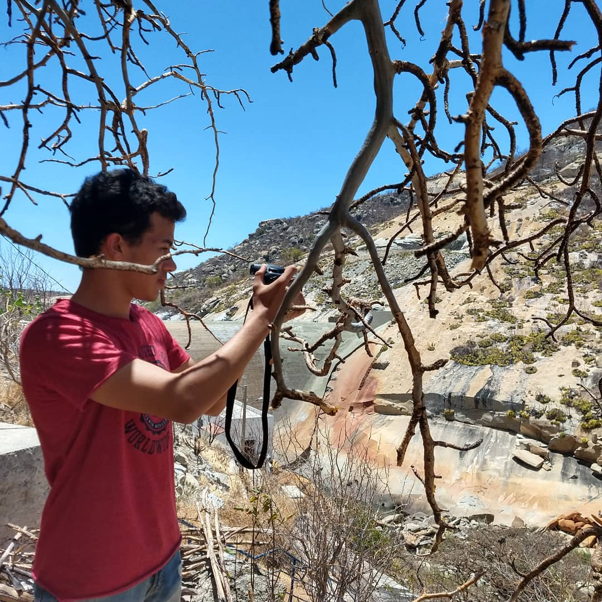
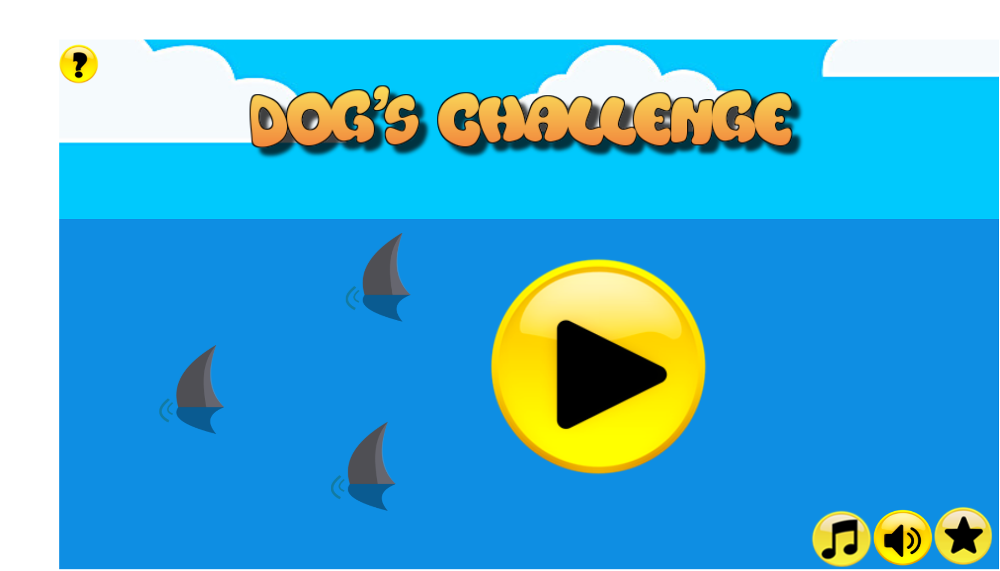
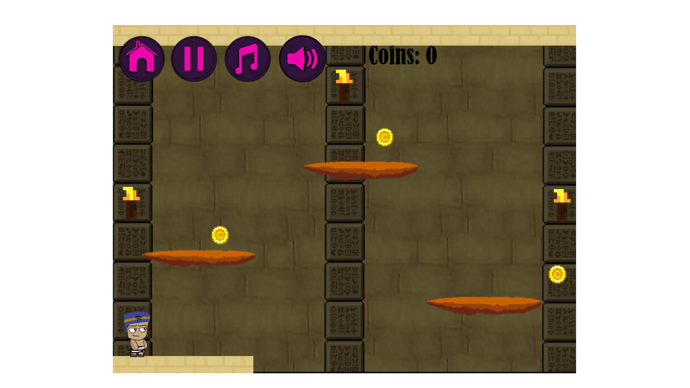
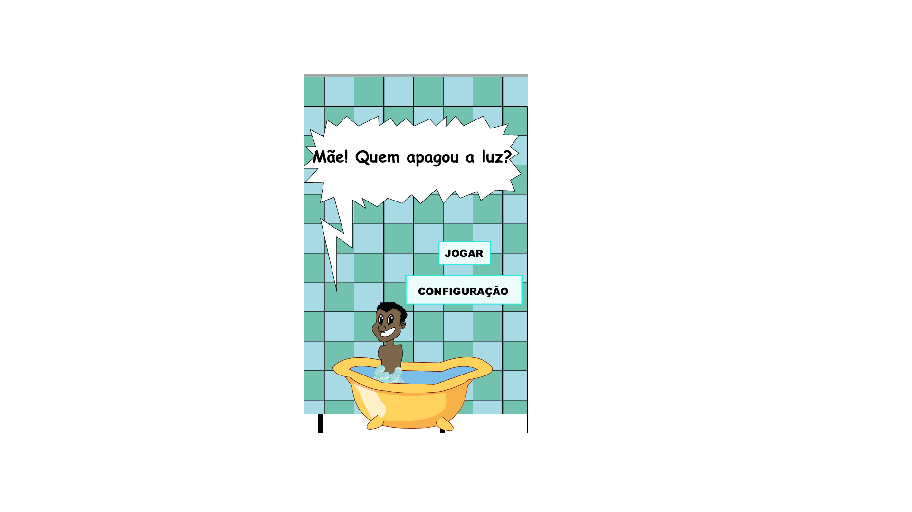

# Portifólio

## Sobre mim...

Eriky Joseph, 18

IFRN - Campus Ceará Mirim 

Programação de Jogos Digitais, 3M 

Karateca 

# Alguns dos meus trabalhos... 

<a href = "https://ruanaffff.github.io/CAOZINHOGUB/" target = "_blank" > Dog Challenge </a>

<a href="https://hadssajordana7.github.io/earthhalf/" target="_blank"> Earth Half </a>

<a href="https://hanzpeters.github.io/Paneboom/" target="_blank"> Paneboom </a>

<a href="https://erikyjoseph.github.io/maequemapagou/" target="_blank"> Mãe! Quem apagou a luz? </a>

### Instagram 

@josepheriky_

### Facebook 

Eriky Joseph

